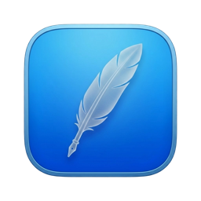

  

<h1 align="center">LightGet</h1>

A fast, native macOS screenshot and annotation tool.
Built with Swift + AppKit + ScreenCaptureKit — no Electron.

Press a hotkey, the screen dims, you select an area and annotate it right there
(arrows, shapes, text), then copy to the clipboard or save to a file.

## Features

- **Global hotkey** (default ⇧⌘2) — works from anywhere, even over fullscreen apps.
- **Multi-monitor** — every display dims and is interactive; select on any screen.
- **Live annotation** directly on the screenshot:
  - Arrow, rectangle (outline), filled rectangle (great for censoring), freehand pen
  - Text with color, background color, resize, and rotation
- **Copy** to clipboard (⌘C / ⌘X / Enter) or **save** as PNG.
- **macOS-style filenames** — `Screenshot 2026-06-01 at 19.49.10.png`, never overwrites.
- **Settings** — change the hotkey, language (EN/RU), dim level, default save folder,
  menu-bar icon (presets or a custom image), Retina downscaling, launch at login.
- **Game-friendly** — forces the cursor visible when a fullscreen game has hidden it,
  and restores focus to the game afterwards.
- Lives in the menu bar, no Dock icon.

## Requirements

- macOS 14 (Sonoma) or later
- Xcode 16+ to build

## Build & run

1. Open `SnapEdit.xcodeproj` in Xcode.
2. Press ⌘R.
3. On first capture, grant **Screen Recording** permission:
   System Settings → Privacy & Security → Screen Recording → enable LightGet,
   then relaunch.

## Usage

- **⇧⌘2** — dim the screen and start a selection (or use the menu-bar item).
- Drag to select an area; drag the handles to resize, drag inside to move.
- Toolbar: cursor / arrow / rectangle / filled rectangle / pen / text, color picker,
  undo, copy, save, close.
- **⌘C**, **⌘X**, or **Enter** — copy. **⌘S** — save. **Esc** — cancel.
- Text tool: click to place, type, **Enter** to confirm, **Shift+Enter** for a new line,
  drag to move, corner handles to resize and rotate, inline panel for text/background color.

## Video demo

https://github.com/user-attachments/assets/ac8c00cf-3264-4689-9c85-90b17594d783

## Screenshots
1:

2:

3:

<!--

-->

## Project structure

| File | Responsibility |
| --- | --- |
| `main.swift` | Entry point |
| `AppDelegate.swift` | Menu bar, global hotkey, capture trigger |
| `HotKey.swift` | Global hotkey registration (Carbon) |
| `ScreenCapture.swift` | Screen capture via ScreenCaptureKit |
| `OverlayController.swift` | Transparent overlay windows on every screen |
| `OverlayView.swift` | Dimming, selection, handles, drawing, rendering |
| `ToolbarView.swift` | Floating toolbar and text color panel |
| `Annotation.swift` | Annotation model |
| `Settings.swift` | UserDefaults-backed settings |
| `SettingsWindowController.swift` | Settings window |
| `Localization.swift` | Runtime EN/UA/RU localization |

## License

Licensed under the **GNU General Public License v3.0** (GPL-3.0) — see [LICENSE](LICENSE).

In short: anyone is free to use, study, modify, and share this software,
and may even sell it or offer paid support. The one condition is copyleft —
if you distribute a modified version, you must release its source code under
the same GPL-3.0 license. It cannot be turned into a closed, proprietary product.

Copyright (c) 2026 Sergey Emelyanov.
